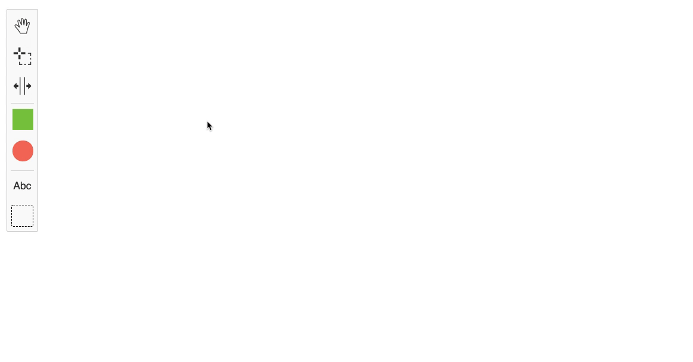

# postit-js

[](https://app.netlify.com/sites/postit-js-demo/deploys) [](https://travis-ci.com/pinussilvestrus/postit-js)

Create post-it boards - built with [diagram-js](https://github.com/bpmn-io/diagram-js).



Checkout the [**Demo**](https://postit-js-demo.netlify.app/)

## Features

* Create resizable Post-its on the Canvas (squared and circled) via
  * Palette
  * Double Click (latest element type will be respected)
* Change the color of Post-its
* Create simple Text Boxes on the Canvas

### Development Setup

Spin up the application for development, all strings attached:

```sh
$ npm install
$ cd  example
$ npm install
$ npm run dev
```

## License

MIT

Contains parts of ([bpmn-io](https://github.com/bpmn-io)) released under the [bpmn.io license](http://bpmn.io/license).
